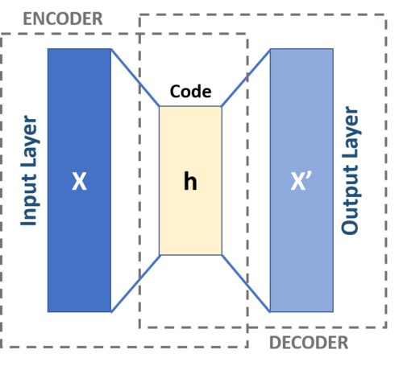
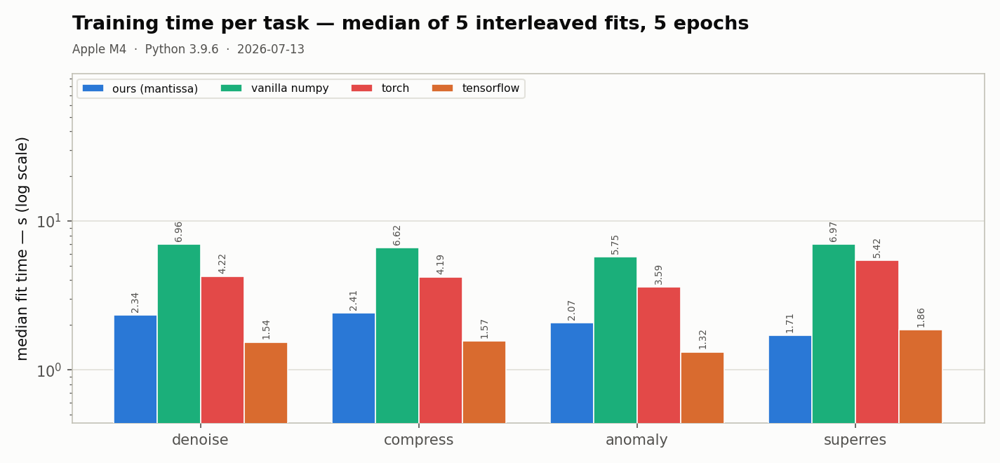
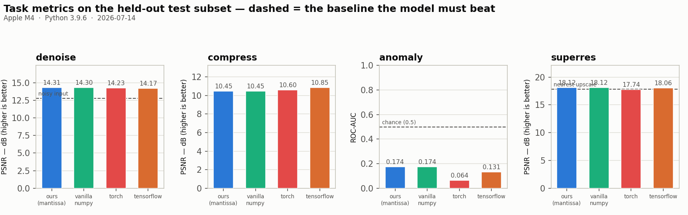
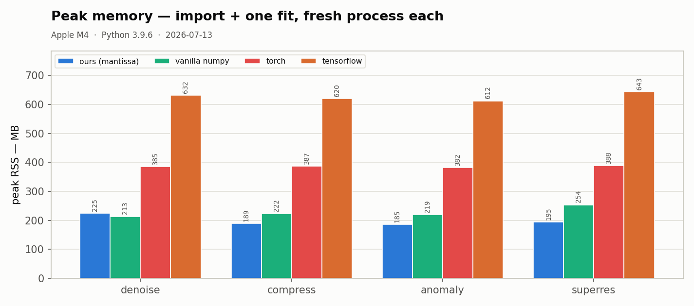
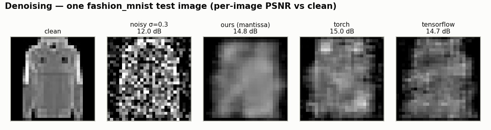
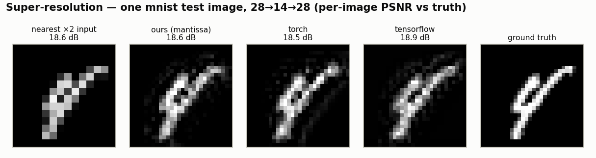

# mantissa-autoencoder


[](https://github.com/tekinertekin/mantissa-cnn)
[](https://github.com/tekinertekin/mantissa)

**Classic autoencoders, with a C engine.**

Convolutional autoencoders (`fit` / `encode` / `decode` / `reconstruct`)
built on top of [mantissa-cnn](https://github.com/tekinertekin/mantissa-cnn):
its Conv2D / MaxPool2D / Flatten / Dense layers, its
[mantissa](https://github.com/tekinertekin/mantissa) C-engine and pure-numpy
backends, and its dataset loaders are all reused, not reimplemented. This
package adds only what an autoencoder needs on top of a classifier: the two
decoder layers (`Upsample2D`, `Reshape`), an MSE-trained `Autoencoder`, a
three-model zoo, and helpers for the four tasks autoencoders are classically
used for — denoising, compression, anomaly detection, super-resolution.

Deliberately minimal, like the rest of the family: NCHW float32 images,
pixel MSE, plain SGD. No autograd graph, no optimizer zoo. The convolutions
run in C on zero-copy float32 buffers; the loss and the nearest-neighbor
upsample are memory-bound array movement and honestly stay in numpy. Layers
allocate their scratch once per batch shape and reuse it — steady-state
training does no per-batch allocation.

## Install

```sh
pip install mantissa-autoencoder   # after PyPI publication
```

This pulls in `mantissa-cnn >= 0.1.0` (which pulls the engine
`mantissa-nn >= 0.2.1`).

From checkouts (works today, no PyPI needed): clone this repo, `cnn`, and
[mantissa](https://github.com/tekinertekin/mantissa) side by side, build the
engine (`make dist` there), then here:

```sh
pip install -e ../cnn && pip install -e ".[dev]"
```

mantissa-cnn finds the sibling engine checkout automatically, and this
package finds mantissa-cnn's `data/` directory automatically (set
`MANTISSA_CNN_DATA` to override).

## Quickstart

```sh
# datasets are mantissa-cnn's; nothing downloads implicitly — fetch once:
python -m mantissa_cnn.datasets download fashion_mnist
```

```python
from mantissa_autoencoder import models, datasets, tasks

X_train, _, X_test, _ = datasets.load("fashion_mnist")   # labels unused
ae = models.denoise_ae()                 # C engine; backend="numpy" also works
print(ae.summary())

# the denoising recipe: corrupt the INPUT, reconstruct the clean target
ae.fit(X_train, epochs=5, batch_size=32, lr=0.01,
       noise=lambda x: tasks.add_gaussian_noise(x, sigma=0.3), verbose=True)

noisy = tasks.add_gaussian_noise(X_test, sigma=0.3)
print("PSNR noisy   :", tasks.psnr(noisy, X_test))
print("PSNR denoised:", tasks.psnr(ae.reconstruct(noisy), X_test))
```

Or compose your own from mantissa-cnn's layers plus the two added here:

```python
from mantissa_cnn import Conv2D, MaxPool2D, Flatten, Dense
from mantissa_autoencoder import Autoencoder, Upsample2D, Reshape

ae = Autoencoder(
    encoder_layers=[Conv2D(16, 3, pad=1), MaxPool2D(2),
                    Flatten(), Dense(32)],           # 784 pixels -> 32 floats
    decoder_layers=[Dense(16 * 14 * 14, act="relu"), Reshape((16, 14, 14)),
                    Upsample2D(2), Conv2D(1, 3, pad=1, act="identity")],
    seed=0)
```

## New to autoencoders? The idea, and the four things it buys

An autoencoder is a network trained to output its own input. That sounds
useless until you make it *hard*: the **encoder** squeezes the image down —
pooling away resolution, or all the way to a few numbers — into a
**bottleneck** code, and the **decoder** has to rebuild the image from that
code alone. Reconstruction error is the whole training signal (no labels),
so the only way to do well is for the code to keep what actually matters
about the image and drop the rest. The compression *is* the learning.



**Why our decoders upsample-then-convolve.** A decoder must grow small
feature maps back to image size. The obvious inverse of convolution —
transposed convolution — overlaps its kernel footprints unevenly and stamps
a checkerboard pattern into the output. Nearest-neighbor resize followed by
a plain convolution cannot produce that artifact by construction, at the
same parameter cost (Odena, Dumoulin & Olah, 2016, "Deconvolution and
Checkerboard Artifacts", *Distill*). That is `Upsample2D` + `Conv2D`
everywhere in this zoo, and why there is no `ConvTranspose2D`.

**Denoising.** Corrupt the input, keep the target clean, and the identity
shortcut is gone: the network can only succeed by learning what digits and
sleeves *look like* and using that to fill in what the noise destroyed.
Denoising started as a way to force robust features, not as an application —
the cleaned-up image was the byproduct (Vincent, Larochelle, Bengio &
Manzagol, 2008, "Extracting and Composing Robust Features with Denoising
Autoencoders", *ICML*).

**Compression.** Make the bottleneck a handful of numbers and the code
becomes a learned, lossy compression of the image — Hinton & Salakhutdinov
squeezed MNIST digits through 30 floats and reconstructed recognizably,
beating PCA at equal dimension because the mapping is nonlinear (2006,
"Reducing the Dimensionality of Data with Neural Networks", *Science*
313(5786)). Our compress task quantizes the 32-float code to uint8 and
counts real shipped bytes: 40 per image against the 784-byte original.

**Anomaly detection.** Train on normal data only. The autoencoder learns to
reconstruct what it has seen — and only that. Feed it something it never saw
and the reconstruction goes wrong, so per-sample reconstruction error is an
anomaly score, no anomaly labels needed at training time (Sakurada & Yairi,
2014, "Anomaly Detection Using Autoencoders with Nonlinear Dimensionality
Reduction", *MLSDA*). Our task holds digit 1 out of training and asks the
error to rank the unseen 1s highest.

**Super-resolution.** Upscale a low-res image by simple interpolation
outside the net, then train a small stack of convolutions to refine that
blurry guess toward the original — SRCNN showed three conv layers
(extraction → mapping → reconstruction) beat the classical
sparse-coding pipeline (Dong, Loy, He & Tang, 2014/2016, "Image
Super-Resolution Using Deep Convolutional Networks", *TPAMI* 38(2)). No
bottleneck here; it earns its place as the input→target form of the same
MSE trainer.

**Deliberate non-goals.** U-Net's skip connections pass encoder maps
straight to the decoder, which needs a graph, not a chain — out of scope
for `Sequential`-style stacks (Ronneberger, Fischer & Brox, 2015, "U-Net:
Convolutional Networks for Biomedical Image Segmentation", *MICCAI*, is the
pointer). Variational autoencoders sample the code through the
reparameterization trick and add a KL term — machinery this trainer does
not have (Kingma & Welling, 2014, "Auto-Encoding Variational Bayes",
*ICLR*).

<sub>Autoencoder schema by Michela Massi, via
[Wikimedia Commons](https://commons.wikimedia.org/wiki/File:Autoencoder_schema.png),
licensed [CC BY-SA 4.0](https://creativecommons.org/licenses/by-sa/4.0/) —
redistributed here with attribution, scaled to 500 px.</sub>

## Model zoo

Honest names: classic recipes at small-image scale, with deviations from
the papers flagged in each docstring.

| model | architecture | paper |
|-------|--------------|-------|
| `denoise_ae` | Conv 16 → pool → Conv 32 → pool ‖ Upsample → Conv 16 → Upsample → Conv 1 (identity); spatial 32@7×7 latent. Conv body instead of the paper's dense stacks — flagged | Vincent, Larochelle, Bengio & Manzagol (2008), "Extracting and Composing Robust Features with Denoising Autoencoders", *ICML* |
| `bottleneck_ae` | same conv body around Flatten → Dense(32) ‖ Dense → Reshape; a 32-float linear code (theirs was 30, RBM-pretrained — flagged) | Hinton & Salakhutdinov (2006), "Reducing the Dimensionality of Data with Neural Networks", *Science* 313(5786) |
| `srcnn` | Conv 32@5×5 → Conv 16@3×3 → Conv 1@3×3, size-preserving; input is nearest-upscaled low-res, upscaled *outside* the net (paper uses bicubic — flagged) | Dong, Loy, He & Tang (2014/2016), "Image Super-Resolution Using Deep Convolutional Networks", *TPAMI* 38(2) |

## Datasets

mantissa-cnn's loaders, re-exported (`mantissa_autoencoder.datasets` just
points them at the right `data/` directory from this repo). Same contract:
NCHW float32 in [0, 1], nothing downloads implicitly, `subset()` gives
seeded stratified slices. mnist / fashion_mnist / kmnist / qmnist / cifar10 —
sources, sample gallery and download CLI are documented in
[mantissa-cnn](https://github.com/tekinertekin/mantissa-cnn#datasets).

## Results

<!-- BEGIN:BENCH (bench/speed.py + bench/plots.py output; do not edit outside these markers) -->
Protocol (fixed in `bench/protocol.py` before the first number was
measured): the **same architecture, re-expressed layer-for-layer in each
framework** (`torch.nn.Sequential` eager, `tf.keras.Sequential`, our
encoder/decoder stacks — parameter counts asserted equal by
`python -m bench.contenders`), identical hyperparameters everywhere —
plain SGD, lr 0.01, batch 32, 5 epochs, MSE, seed 0 — on stratified
2000-train / 1000-test subsets, CPU only. Fit wall-time is the median of
5 interleaved repeats (one untimed warm-up each); reconstruct is a batch
pass over the 1000-image test subset, median of 20 interleaved calls;
peak RSS is one fresh subprocess per (contender, task), import cost
included. Task metrics come from the models the benchmark itself trained.
`vanilla numpy` is our pure-numpy reference backend — no mantissa engine —
showing what the C core buys.

**denoise** — fashion_mnist, Gaussian σ 0.3 on the input only; the noisy
test input scores **12.77 dB** against clean, the floor every model must
beat:

| contender | fit (s) ↓ | reconstruct (ms) ↓ | PSNR (dB) ↑ | peak RSS (MB) ↓ |
|-----------|----------:|-------------------:|------------:|----------------:|
| tensorflow | **1.539** | 58.3 | 14.17 | 632 |
| **ours (mantissa)** | 2.336 | 53.7 | **14.29** | 225 |
| torch | 4.224 | **48.2** | 14.23 | 385 |
| vanilla numpy | 6.958 | 236.2 | 14.23 | **213** |

**compress** — mnist through a 32-float code, then uint8-quantized: 32
code bytes + an 8-byte range header = 40 B/image vs the 784-byte uint8
original, an honest **19.6×** (quantization costs < 0.001 dB at this code
size — the float32-code PSNR is in the JSON):

| contender | fit (s) ↓ | reconstruct (ms) ↓ | PSNR @ 19.6× (dB) ↑ | peak RSS (MB) ↓ |
|-----------|----------:|-------------------:|--------------------:|----------------:|
| tensorflow | **1.570** | 55.4 | **10.85** | 620 |
| **ours (mantissa)** | 2.405 | 55.3 | 10.45 | **189** |
| torch | 4.193 | **42.0** | 10.60 | 387 |
| vanilla numpy | 6.624 | 210.6 | 10.45 | 222 |

**anomaly** — mnist, digit 1 held out of training (1800 fit samples),
per-sample reconstruction MSE as the score, held-out 1s positive:

| contender | fit (s) ↓ | reconstruct (ms) ↓ | ROC-AUC | peak RSS (MB) ↓ |
|-----------|----------:|-------------------:|--------:|----------------:|
| tensorflow | **1.320** | 55.6 | 0.131 | 612 |
| **ours (mantissa)** | 2.066 | 55.0 | 0.174 | **185** |
| torch | 3.593 | **42.1** | 0.064 | 382 |
| vanilla numpy | 5.750 | 210.5 | 0.174 | 219 |

**superres** — mnist 28 → 14 (2×2 mean) → nearest-upscaled back to 28
outside the net, `srcnn` refines; the nearest-upscaled input scores
**17.82 dB**, the floor:

| contender | fit (s) ↓ | reconstruct (ms) ↓ | PSNR (dB) ↑ | peak RSS (MB) ↓ |
|-----------|----------:|-------------------:|------------:|----------------:|
| **ours (mantissa)** | **1.712** | **42.8** | **18.12** | **195** |
| tensorflow | 1.860 | 58.6 | 18.06 | 643 |
| torch | 5.420 | 72.8 | 17.74 | 388 |
| vanilla numpy | 6.972 | 188.3 | 18.12 | 254 |





The galleries below are the models the benchmark trained — same seed,
same test image, nothing retrained or cherry-picked:




**The honest read.**
- **Fit: TensorFlow's compiled graph leads three of four tasks** (1.32–1.57 s,
  about 1.5× ahead of us); ours takes superres and beats torch eager
  1.7–3.2× on every task; the numpy backend trails ours 2.7–4.1×. The
  pattern has a mechanical explanation: autoencoder decoders convolve at
  **full 28×28 resolution** — the heavy-conv regime where the cnn repo's
  benchmark also found TF's graph executor strongest (mantissa 0.2.2's
  conv-GEMM release closed that repo's VGG gap to 8%) — and our two
  parameter-free decoder stages (`Upsample2D`, and the denoise task's
  corruption) are memory-bound numpy running *between* engine calls,
  where TF fuses everything into one graph. The control: `srcnn` is the
  one architecture with **no upsample and no pooling** — pure engine
  convolutions — and there ours is fastest outright. An engine-side
  upsample/fusion primitive is the recorded next target.
- **Reconstruct is a three-way photo finish** (42–73 ms across ours /
  torch / tf per task, winner varying); the numpy backend is 4× slower.
- **Peak memory is ours across the board**: 185–225 MB against ~385 MB
  for torch and 612–643 MB for tensorflow — a 2× and ~3.2× gap, fresh
  process, import included.
- **Task quality lands in the same band for everyone**, as it must with
  identical structure and budget: denoise within 0.13 dB (all 1.4–1.5 dB
  above the noisy input), superres ours/tf above the nearest baseline
  with torch 0.08 dB below it, compress spread 0.4 dB with TF ahead —
  differences of this size are init/shuffle-stream noise (seeded per
  framework; they cannot be made bit-identical across libraries), not
  framework superiority. The engine's metrics match its numpy oracle's
  to within 0.0002 dB on every deterministic task — same model, just
  faster.
- **The anomaly recipe fails honestly, for every framework** (AUC
  0.06–0.17, far *below* chance 0.5). With digit 1 held out,
  reconstruction-error detection breaks: 1s are the lowest-complexity
  digit, and an autoencoder trained on the other nine reconstructs their
  thin strokes *better* than average — reconstruction MSE is confounded
  with image complexity, a known failure mode of the Sakurada & Yairi
  recipe. The protocol pinned digit 1 before any measurement, so the
  number is reported as measured; all four contenders agree, which is
  exactly what the column is for — it compares frameworks, not the
  recipe's wisdom.

**Fairness caveats.** TF's one-time graph tracing is excluded from fit
timing via an identical untimed warm-up for every contender (as imports
are); torch runs eager, its default mode. CPU only — no MPS/Metal for
anyone. The per-batch denoise corruption uses each framework's native
RNG (numpy / `torch.randn` / a `tf.data` map) — same distribution,
different streams. Keras is NHWC, so its dense bottleneck connects to a
permuted flatten — identical parameter count and function class. Thread
settings left at each framework's defaults and recorded in the JSON. All
raw samples live in `bench/results/results.json` (regenerable,
gitignored).

**Environment.** Apple M4 · Python 3.9.6 · numpy 2.0.2 · torch 2.8.0 ·
tensorflow 2.20.0 · mantissa 0.2.2 (f32 CNN primitives, conv-GEMM
release) · 2026-07-13. Full run: 409 s.
Reproduce: `python -m bench.contenders && python -m bench.speed &&
python -m bench.plots`.
<!-- END:BENCH -->

### Methodology

Identical architectures, subsets, epochs, batch size, learning rate and
seeds for every contender; timings are medians over interleaved repeats on
one machine, library versions recorded in the results JSON. Peak RSS is
measured per contender in a fresh subprocess because that is what a user
pays. *Measure, don't assume.*

## License

MIT — © Tekin Ertekin. Base package:
[mantissa-cnn](https://github.com/tekinertekin/mantissa-cnn); engine:
[mantissa](https://github.com/tekinertekin/mantissa) — same author, MIT.
